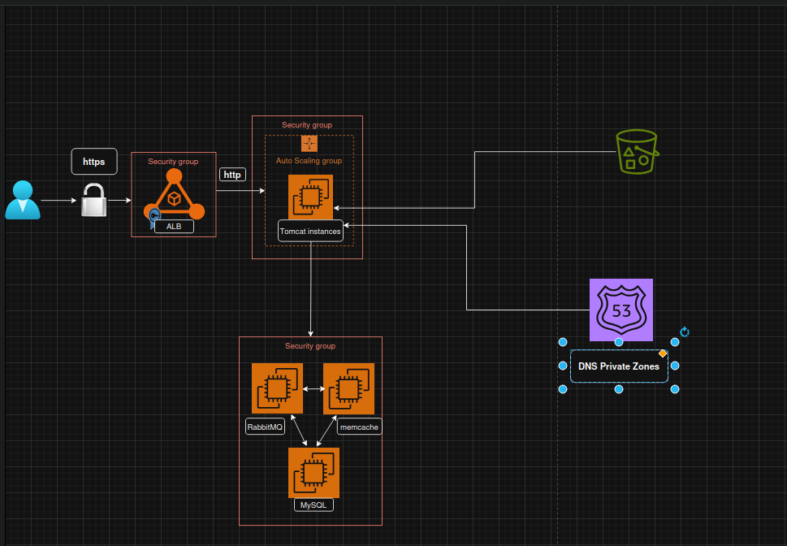

# vProfile AWS Lift & Shift Migration

This project showcases a Lift & Shift migration of the [vProfile Java-based web application](https://github.com/hkhcoder/vprofile-project) to Amazon Web Services (AWS). The goal is to replicate the original multi-tier architecture using EC2 instances, secure networking, DNS, object storage, and load balancing — all deployed manually using EC2 user data scripts.

## Project Overview

- Migrated vProfile app to AWS using EC2, ALB, S3, Route 53, and ACM.
- Services were provisioned using EC2 User Data scripts (Bash).
- WAR artifact built locally and uploaded to Amazon S3.
- SSL/HTTPS enabled using AWS Certificate Manager (ACM).
- Domain managed via GoDaddy, pointed to AWS ALB.
- Internal services communicate over private DNS using Route 53.

## Services & Tools Used

| Service     | Purpose                                               |
|-------------|--------------------------------------------------------|
| EC2         | Hosts app & backend services                           |
| S3          | Stores WAR artifact                                    |
| Route 53    | Internal DNS resolution for backend services           |
| ACM         | SSL Certificate management                             |
| ALB         | HTTPS Load Balancer for public traffic                 |
| GoDaddy     | Custom domain mapped to ALB                            |
| IAM         | EC2 access to S3 using roles                           |
| User Data   | Bootstrapping services on instance launch              |

## Internal DNS Setup (Route 53)

Backend services (MySQL, RabbitMQ, Memcached) are referenced in the `application.properties` file via internal DNS names:

```properties
db.host=db01
mq.host=rmq01
cache.host=mc01
```

These hostnames are mapped via Route 53 Private Hosted Zone to their corresponding EC2 private IPs.

## HTTPS & Domain Integration

- SSL certificate created and validated using AWS Certificate Manager (ACM).
- ALB configured to use the certificate on port 443 (HTTPS).
- A domain was purchased via GoDaddy.
- GoDaddy DNS was configured to point `www.yourdomain.com` to the ALB's DNS name.

## Build & Deployment Flow

### 1. Build the WAR File

```bash
mvn clean install -DskipTests
```

### 2. Upload WAR to S3

```bash
aws s3 cp target/vprofile-v2.war s3://your-bucket-name/vprofile-v2.war
```

### 3. EC2 Instance Downloads the WAR

This is handled in the Tomcat EC2 instance's user data script:

```bash
aws s3 cp s3://your-bucket-name/vprofile-v2.war /usr/local/tomcat/webapps/
```

## Architecture Diagram



## Notes

- All EC2 instances are within the same VPC.
- Proper Security Groups and private subnet routing were configured.
- Auto Scaling Group (ASG) was used for the Tomcat application layer.
- No IaC (e.g. Terraform or Ansible) was used — this project focuses on manual provisioning to reinforce cloud fundamentals.

## Author

**Bahy Ahmed** — Cloud/DevOps Engineer  
[LinkedIn](https://www.linkedin.com/in/bahyahmed)  
[GitHub](https://github.com/bahyahmed)

## License

This project is for educational and portfolio showcase purposes only.
